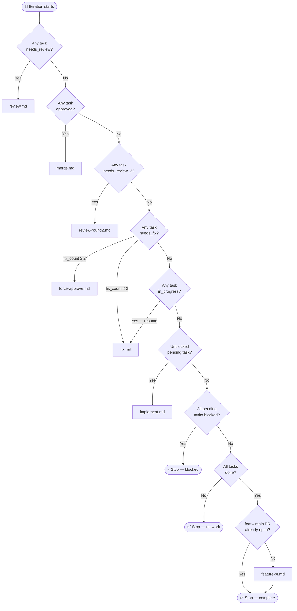
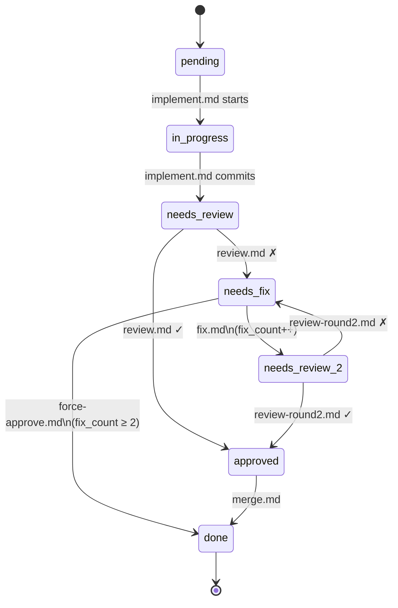

# Ralph — Routing Logic

## Per-iteration routing

Each iteration, Ralph scans task state and picks a mode using the following priority order:

## Task lifecycle

State machine for a single task, driven by mode file outcomes:

> **Note:** `in_progress` is a crash-recovery sentinel. If Ralph is killed mid-implement, the next iteration sees `in_progress` and routes to `fix.md` to resume. Within a normal run it is transient.
