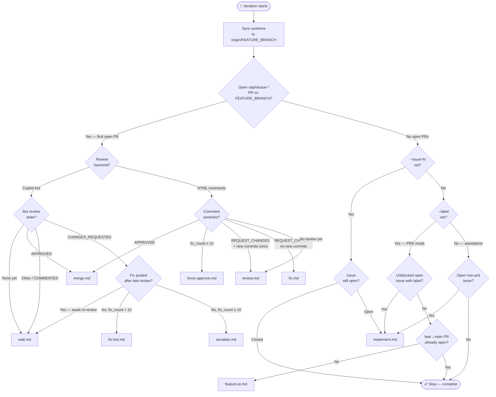
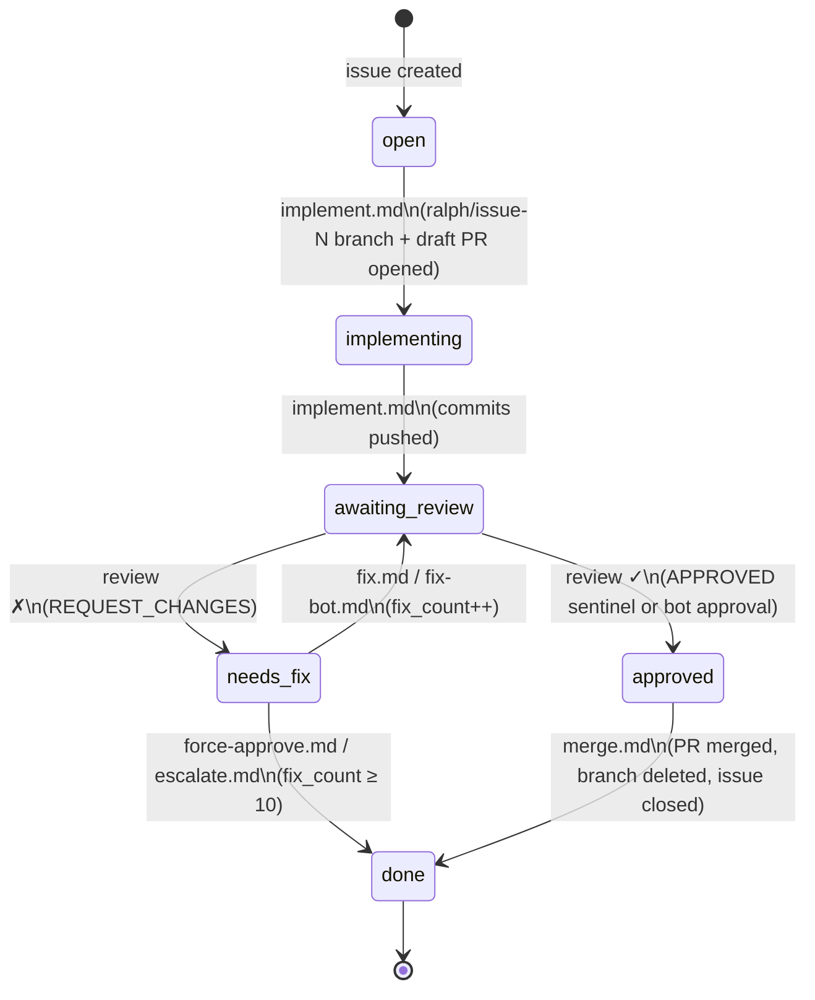

# Ralph — Routing Logic

## Per-iteration routing

Each iteration, Ralph syncs the worktree then picks a mode. If an open `ralph/issue-*` PR exists, the review backend determines the path. Otherwise Ralph looks for the next issue to implement.

## Task lifecycle

State machine for a single issue. State is inferred each iteration from the PR's review comments — nothing is stored explicitly.

> **Note:** `wait` is a transient hold state (not shown above) used when the Copilot bot has been asked to review but hasn't responded yet, or when a fix has been posted and Ralph is waiting for the bot to re-review.
